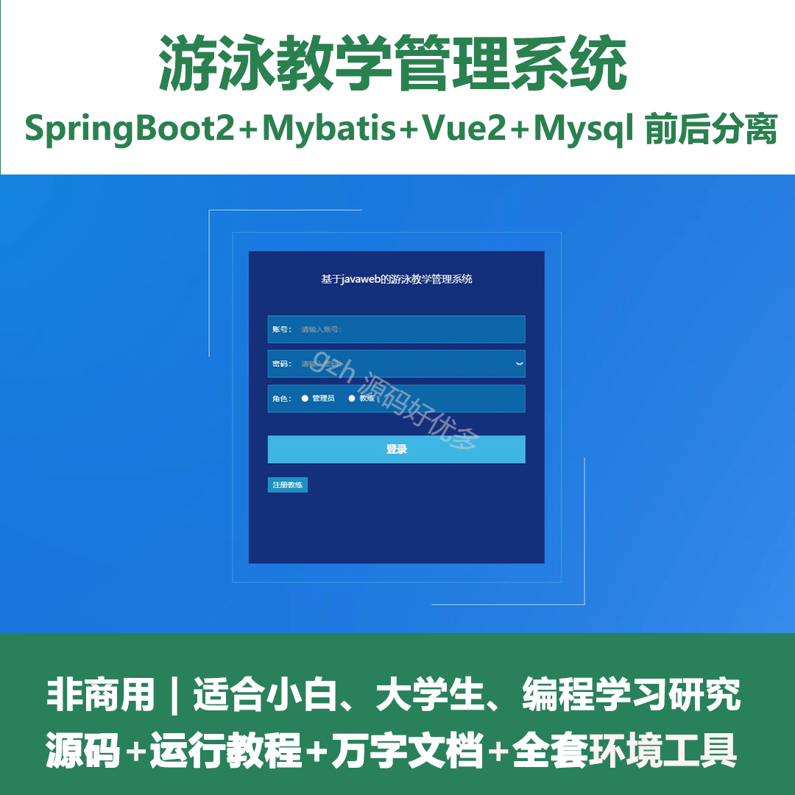
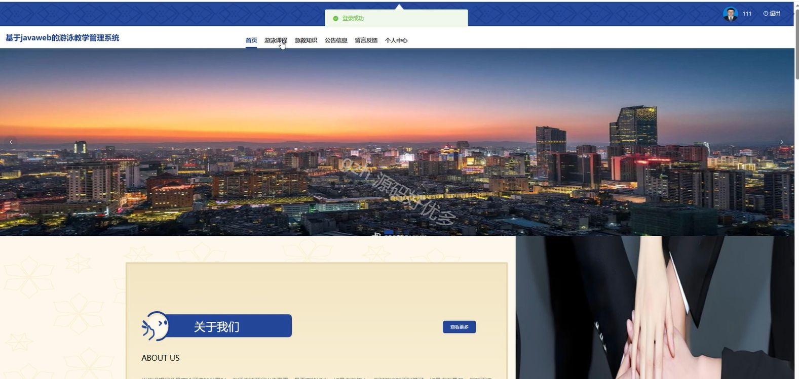
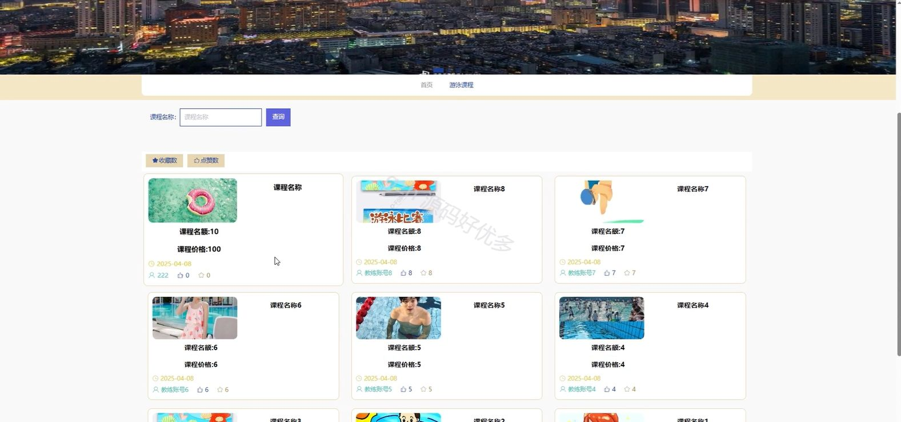
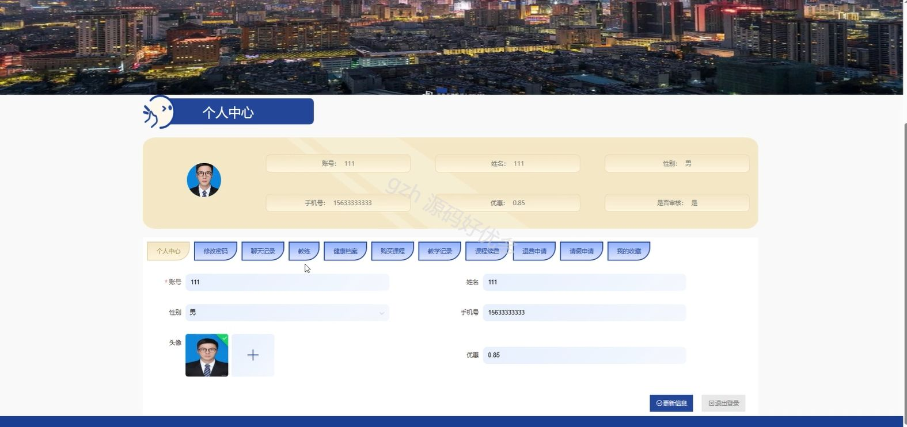
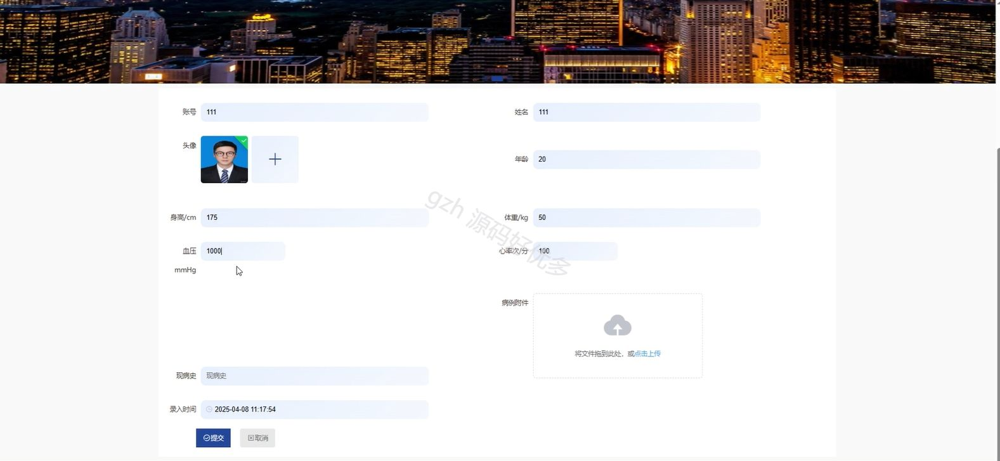
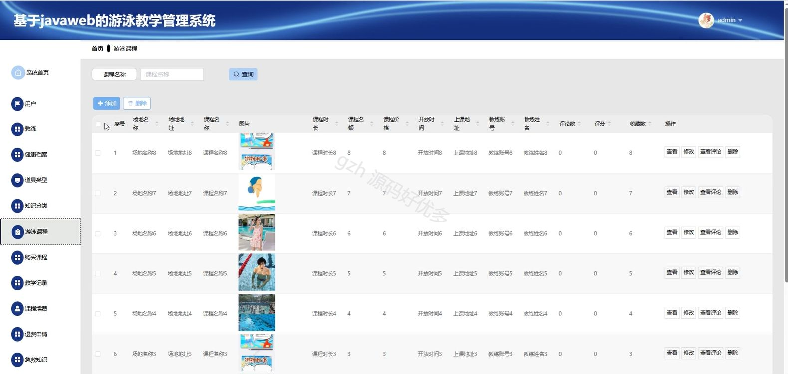
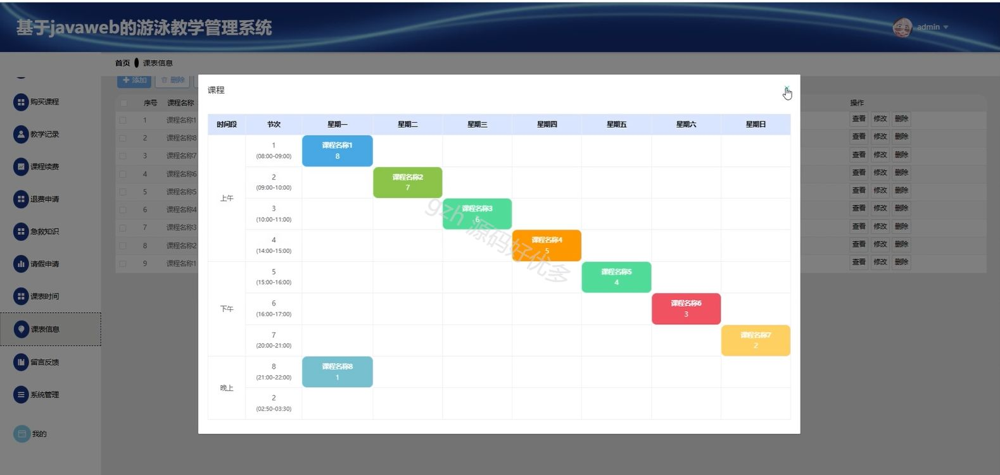
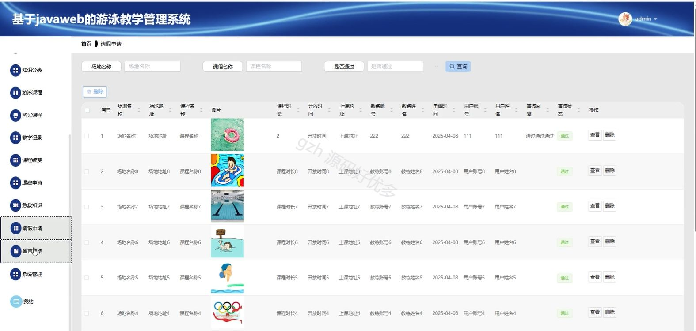
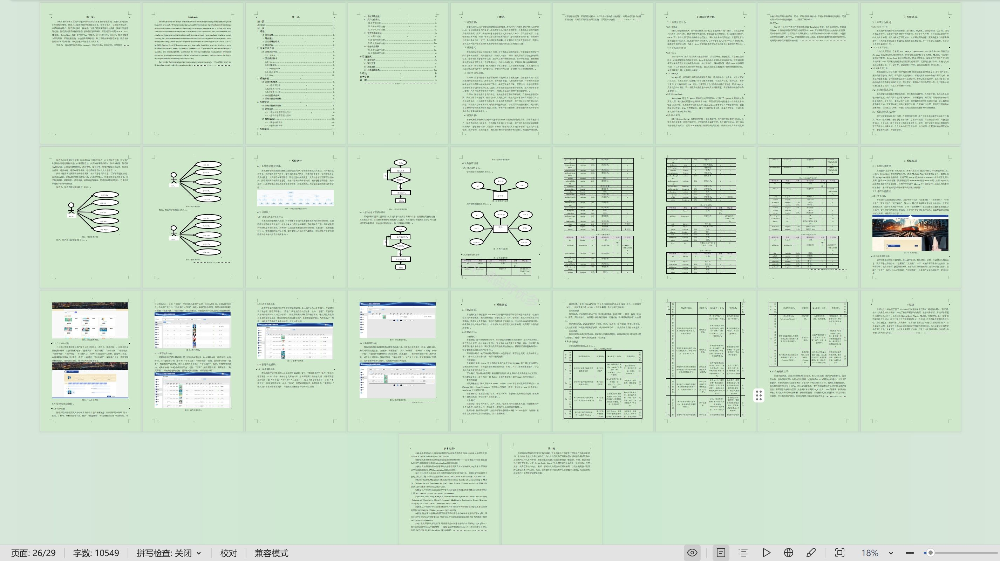

# springbootA260D
springbootA260D基于javaweb的游泳教学管理系统
## 查看主页获取源码

### 一、关键词

游泳课程、教学记录、教练管理

 

### 二、作品包含

源码+数据库+设计文档万字+全套环境和工具资源+部署教程

 

### 三、项目技术

前端技术：Html、Css、Js、Vue2.0、Element-ui 
后端技术：Java、SpringBoot2.0、MyBatis

  

 

### 四、运行环境（以下版本亲测，其他版本未知，请自测）

开发工具：IDEA/eclipse  + VSCODE

数据库：MySQL5.7（最低要5.7版本）

数据库管理工具：Navicat10以上版本

环境配置软件： JDK1.8 + Maven3.6.3

前端Nodejs：14

浏览器：谷歌浏览器

 

### 五、项目介绍

项目编号：springbootA260D

基于JavaWeb的游泳教学管理系统是用以高效管理学员信息、教练、课程的综合性平台。

角色：管理员、用户、教练

管理员功能：系统首页、用户、教练、健康档案、道具类型、知识分类、游泳课程、购买课程、教学记录、课程续费、退费申请、急救知识、请假申请、留言反馈、系统管理、我的。

用户功能：首页、游泳课程、急救知识、公告信息、留言反馈、个人中心、修改密码、聊天记录、教练、健康档案、购买课程、教学记录、课程续费、退费申请、请假申请、我的收藏。

教练功能：系统首页、用户、游泳课程、购买课程、教学记录、课程续费、退费申请、急救知识、请假申请、我的。

 

### 六、运行截图

